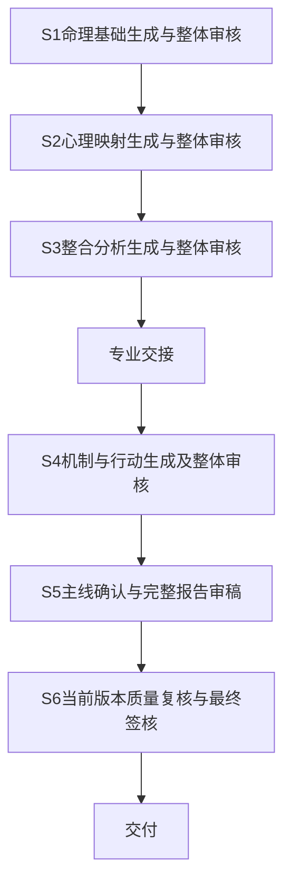

# 咨询师工作台流程优化讨论稿

日期：2026-10-07。状态：已确定采用 C，保留六节点及各节点审核时点；节点内具体优化待共同讨论。

依据：用户提供的《咨询师工作台使用反馈.docx》（正文及八张图片）、当前《咨询师工作台操作手册》、报告协作约定和现有分析审核实现。反馈文档作为产品需求材料；其中“先重构”等表述不直接视为修改应用的授权。本稿记录建议，不替代当前产品框架、设计系统、权限或交付规则。

本次讨论聚焦报告生产与审核流程。目标是让系统完成完整分析，让咨询师通过关键判断、整体阅读和针对性修订承担审核责任，减少重复切换及无实质意义的确认。

## 当前问题与设计目标

目前 S1–S4 要先确认关联判断，再确认对应分析，完成覆盖后才能进入下一节点；S5 要确认主线、编排和每段正文；S6 再处理质量问题并做最终复核。这些要求同时存在于界面和后端，取消界面按钮本身不能完成流程优化。

反馈要求保留格局、喜忌以及出生时间和时柱的关键核对，把月令、十神等计算结果交给程序，并把心理映射改成完整成果的整体审核。由此提出四个目标：

- 计算事实自动生成和校验，不再要求咨询师重复确认每个字段。
- 解释性分析完整保留，但普通条目不再逐条点击通过。
- 人工审核以完整成果为主，系统提示帮助定位重点。
- 专业签核绑定具体版本、范围及处理记录，继续保留来源和交付责任。

“没有检测到异常”表示检测没有发现问题，不等于分析已经人工审核或结论必然成立。

## 已确定的介入方式

用户选择 C：依旧保留多次审核，优化减少每个节点内部的审核工作。S1–S6 继续作为流程主导航，各节点审核完成后才能进入下一节点。专业交接仍位于 S3 到 S4，前序未审核候选不传入后序正式分析。

后续建议围绕“关键项集中确认、完整成果整体审阅、异常定位修订、本节点整体通过”设计。取消普通判断和分析的重复点击，不以减少必要的专业判断为目标。一个节点中确有必要的关键决策仍可保留独立操作，例如 S5 的主线确认。

用户消息中的第 2 点尚未补充，暂不视为对专业分工或其他事项的决定。本稿按当前 S1–S3 命理、S4–S6 心理的分工继续提出方案。

## 建议流程

前后台继续保留 S1–S6。每个节点默认围绕完整成果组织审核界面，把上游资料、计算、来源、运行记录和覆盖详情作为按需入口，减少在“判断审核”和“分析内容”之间往返。AI 生成与检查明确展示进度、失败和继续入口；是否在前序通过后自动启动下一节点生成，留待单独确定。

资料不足或专业分歧未解决时，系统展示具体原因及受影响范围，进入补问或待专业处理状态；不使用默认值补造出生时间、经历或解释结论。

## 六节点的审核重点

| 节点 | 建议保留的人工工作 | 建议减少的操作 |
| --- | --- | --- |
| S1 命理基础 | 集中核对出生与时间口径，确认时柱、格局和喜忌，审阅基础解释 | 普通计算字段和十四个方向不逐条点通过；判断及分析在同一处阅读修订 |
| S2 心理映射 | 整体阅读心理映射，核对用户自述、事实与假设边界，处理矛盾和补问 | 不把每条映射拆成判断确认及分析确认两轮 |
| S3 三重整合 | 整体核对核心张力、发展方向和前序冲突，确认交心理侧的成果 | 不重复确认已经审核且未变化的 S1、S2 资料与判断 |
| S4 机制、卡点与行动 | 核对机制与用户情境、卡点与行动的对应，集中审阅成长实验 | 行动字段由 AI 填写、程序验证，咨询师只修订不适用处；不逐字段重复输入或逐条通过 |
| S5 报告写作 | 确认主线和重点，通读完整正文并修订，整体确认写作成果 | 推荐主线预选，取消无必要的多方案选择；不要求每段分别点通过 |
| S6 最终审核 | 处理必须解决的问题，通读当前最终稿，完成最终签核和交付 | 同源问题合并，普通表达建议可忽略；复用有效处理记录，不重新审核未变化的上游条目 |

本表是待讨论建议，已确定的只有保留六节点及多次审核。S1 核心确认内容、S5 主线确认方式和 S6 问题分级等具体规则仍可调整。

## 命理基础的具体变化

命理核对页集中显示出生资料、时间口径和命盘，以及格局与喜忌候选。候选随同依据、分歧和限制一起展示。咨询师可以采纳、修订或暂缓，完成后一次确认当前命理基础版本。

| 内容 | 建议处理方式 |
| --- | --- |
| 四柱字段、月令、藏干、十神对应、干支关系、起运数据、星曜位置 | 程序计算及规则校验；异常时要求处理，正常时提供查看入口 |
| 出生时间、历法、地点、时间口径及采用的时柱 | 在命理核对中集中确认；缺失或可能影响时柱时展示差异及补问入口 |
| 格局、旺衰依据、喜忌与用神 | AI 提供候选及理由，由命理师作核心判断 |
| 日支含义、心理线索、命身福德等解释 | AI 保留完整分析，在 S1 整体审阅；不单独增加普通条目的通过按钮 |

S1 的十四个方向混合了计算事实和解释内容。“不逐条人工确认”不能等同于“十四项中其余十二项全部由排盘程序证明正确”。应拆开事实校验与解释审阅，同时保持分析覆盖。

当前排盘代码使用中国 UTC+8 民用钟表时间，明确未校正真太阳时。反馈提出的真太阳时属于新增能力，需要先确定时间口径、地点精度和适用范围。界面应区分原始填报时间、转换结果和最终采用时间，保留出处及版本；采用口径的默认值不能标成用户已核实。首次命理核对集中确认口径，之后只在资料变化或异常时重审。

## 心理映射与整合的具体变化

S2、S3 分别生成完整成果并分别审核。S2 整体通过后，S3 才采用这一已审核版本进行整合；不把两个节点合成一次审核。

S2 默认展示连贯的心理映射内容，包含主要模式、用户资料依据、反证、不确定性和待补问。咨询师在内容中修订，点击引用即可核对来源，不必在判断和分析两套界面中重复审核同一观点。普通条目随本节点整体签核，不再逐条通过。

S3 默认展示核心张力、整合方向、前序支持或冲突以及资料边界。前序已确认且未变化的内容保持只读引用，重点审阅本节点新形成的整合结论。处理重点后确认 S3 当前成果并交接心理侧。

当前 S2 的负责人是命理师，S4–S6 是心理师；本稿延续该分工。若希望把 S2 的心理映射审核移交心理师，需要作为单独的专业边界决策讨论。

## S4 机制与行动审核

把机制解释、核心卡点和对应成长实验放在同一工作区。每个实验显示回应的卡点、具体动作、频率、耗时、观察方式和停止条件；AI 预填，程序检查完整性，咨询师集中核对适用性并修订。无需重复填写已有资料，也不要求每项字段或每条行动单独通过。3–5 项实验等当前内容要求先保留。

## S5 报告审稿页

默认进入完整报告阅读与编辑，保留“你是谁、卡在哪、往哪去、带回日常”的章节结构。阅读者可以直接修订有问题的正文，不需要先切回判断、分析、编排等多个页面。

- 顶部：用户本次议题、报告版本、当前负责人和生成或审核状态。
- 主区：完整报告和章节目录，支持段落修订、补充及查看修改前后差异。
- 重点区：定位到正文的待办提示。每项说明问题、相关资料和建议处理方式。
- 来源入口：从正文按需展开用户原话、计算结果、专业判断及其版本。
- 底部操作：保存修改、更新受影响正文、退回来源修订、确认本节点成果。最终签核和交付位于 S6。

桌面可并排呈现正文与重点区；移动端用“全文”“待办”切换，并从待办直达对应正文。点击提示后保留阅读位置，关闭来源详情后返回原段落。

主线与编排由 AI 推荐一套默认方案，咨询师集中核对主题、重点和章节安排，可以直接修改或查看备选。建议保留“确认主线并生成全文”这一有实质意义的操作，随后连续审稿，不要求逐段点击确认。需要改写时，仅更新受影响内容，并展示差异；不得默默覆盖人工修订。

## S6 最终质量审核

进入 S6 后展示当前完整报告、质量结果和集中待办。先处理阻断与实质问题，表达建议可在正文中集中调整或忽略。正文更新后重检当前完整版本，达标且必须处理的问题清零后，由心理负责人完成最终签核和交付。S6 不要求再次逐条确认 S1–S5 已有效审核的内容，但可以沿来源发现问题并退回。

## 待办提示与审核规则

| 类型 | 示例 | 推进规则 |
| --- | --- | --- |
| 必须处理 | 计算或资料冲突、失效来源、引用不存在、核心依据不足、正文与原始资料矛盾 | 修复或明确补问；未解决不能交接或交付 |
| 重点核对 | 多套解释冲突、缺少反证、心理假设过度确定、行动不适合用户资源 | 在整体审核中修订，或说明保留依据；低把握内容不强行确定 |
| 表达建议 | 重复、术语过多、顺序不顺、语气生硬 | 允许忽略，集中归纳，不把每条建议变成强制待办 |

程序负责字段、结构、引用、覆盖和版本等可验证规则。AI 检查负责提出内容上的可疑点。模型自报的高置信度不能作为跳过审核的依据。

同一来源问题影响多个段落时合并为一个待办，列出全部受影响位置。提示须指向实际内容，方便查看原文、修订、补问或退回来源；保留和误报处理说明理由。

人工仍通读所负责的完整成果，可以主动提出未被系统检测到的问题。审核进度以“关键判断已处理、必须处理问题剩余、整体版本是否签核”为主，不使用逐条点击数证明审核完成。

## 审核与修订的版本关系

生成结果、规则校验、问题处理和专业签核分别记录。当前节点内 AI 候选在整体审核前保持待审；只有本节点整体通过后的有效版本进入下一节点正式分析。系统自动校验不能生成“咨询师已确认”的记录。整体签核明确覆盖哪些判断、分析或报告段落，以及对应版本，不要求每项单独点击。

命理核心修改会使引用旧核心的下游内容需要更新与重审。普通段落修改按依赖范围提示受影响内容，保留无关的有效审核记录。最终质量检查与签核绑定完整报告版本；任何正文修改后，旧最终检查和签核失效，交付前必须核对当前完整版本。

不同专业修订自己的范围；发现另一专业依据有误时提出问题并退回负责人。系统展示修订差异和接续状态，避免把跨专业返工隐含在一次“重新生成”里。

## 交付规则与验收方式

本稿建议先保留现有质量阈值：总分至少 80，事实忠实度至少 16，不确定性与安全至少 8。质量门槛是否调整应另行讨论。普通逐项确认可以取消，完整内容覆盖、有效来源、必须处理问题清零和最终人工签核继续保留。

后续原型与实现至少验证：

- 资料完整且生成成功的申请，保留六节点审核，不用逐条确认即可完成各节点整体审核和报告交付。
- 未完成前序节点整体审核时，下一节点不能采用其待审候选启动正式分析。
- 资料缺失、时柱争议和来源冲突能够在相应位置停下并继续处理。
- 修改命理核心后，受影响的下游内容与签核正确失效。
- 修改报告后，不会用旧版本的质量结果交付。
- 两类咨询师能看到共同成果，写入与签核按专业范围限制。
- 异步生成失败可继续或重试，不要求重做无关审核，不覆盖人工修改。

评估时记录单个案例的人工主动操作数、界面切换数、实际审阅耗时、返工次数和交付后的问题。当前没有可比较的真实操作基线，不预先承诺固定节省比例。

## 下一轮需要确定的决策

1. 补充用户消息中尚未填写的第 2 点；专业分工暂按现状保留。
2. 逐节点确定保留的关键人工决策，先讨论 S1，再讨论 S2–S6。
3. 确定时间口径与真太阳时核对的适用规则。
4. 确定前序审核后下一节点生成的启动方式。
5. 绘制 S1 核对页、S2–S4 整体审核页、S5 审稿页和 S6 最终复核页，再决定实施范围。
