# 辰鉴一期产品需求文档：目标流程与现状基线

| 项目 | 内容 |
|---|---|
| 文档版本 | v0.2，已确认目标流程与代码现状基线 |
| 基线日期 | 2026-10-03 |
| 基线代码 | `master` · `3fec1aa` |
| 文档用途 | 让产品、设计、研发和运营共同掌握目标功能、用户流程、责任边界与实现差距，并据此定义后续版本 |
| 事实来源 | 当前前端路由与页面、后端 API / 领域逻辑、本轮用户确认的产品决策、咨询师工作流设计参考、本地运行截图 |
| 状态说明 | “当前实现”描述仓库可见功能；“已确认目标”是本轮产品决策；“目标设计”是参考附件中的咨询师工作台方向，不代表已上线 |

> 本文把已确认目标、当前代码现状和未决细节分开描述。产品流程以本轮用户确认的四项决策为准；《辰鉴 AI 内容生产工作流与 Skills 架构设计 v1.0》仅作为咨询师工作台与报告生产的目标设计参考，其中提及的 Skills、Evidence / Finding / Fragment、质量闸门及不可变版本等均不据此视为已实现。截图来自本地演示环境，人物、账号和记录为验收演示数据，不代表真实用户资料或线上运营指标。

## 目录

- [文档目标](#1-文档目标)
- [产品概述与已确认决策](#2-产品概述与已确认决策)
- [用户与角色](#3-用户与角色)
- [信息架构](#4-信息架构)
- [核心用户流程](#5-核心用户流程)
- [申请状态与业务规则](#6-申请状态与业务规则)
- [功能需求清单](#7-功能需求清单)
- [非功能与体验基线](#8-非功能与体验基线)
- [已知问题与验证观察](#9-已知问题与验证观察)
- [已确认规则与待团队定义](#10-已确认规则与待团队定义)
- [截图索引](#11-截图索引)
- [自评与补充记录](#12-自评与补充记录)

## 1. 文档目标

本 PRD 是一期产品讨论与范围定义基线。团队可用它核对：

- 用户、咨询师、管理员分别能完成哪些工作。
- 人生说明书申请、咨询师审校交付与决策日历生成之间的目标关系。
- 哪些功能已在代码与页面中出现，哪些与目标规则不一致或尚未闭环。
- 尚未由本轮决策覆盖、需要团队补充的产品细节。

## 2. 产品概述与已确认决策

辰鉴以“见自己、知其序、行其路”为产品方向，把个人资料、当下议题和行动时机组织为可阅读的个人报告与决策日历。产品定位强调自我理解与行动参考，不替用户预测未来或替代现实决策。

一期产品围绕“先交付人生说明书，再按需生成决策日历”形成一条清晰的用户旅程：

- **fi / 人生说明书**：用户提交申请，AI 协助分析和写作，咨询师人工审核、修正后交付；用户不能自助生成或直接取得 AI 初稿。
- **te / 决策日历**：用户必须基于一份已交付的人生说明书发起生成请求；系统由 AI 生成，成功后自动即时交付，不进入人工审核队列。
- **服务交付与运营**：咨询师负责报告申请的专业审核与交付；管理员负责分配、运营观测与后台维护，不承担日历生成审核。

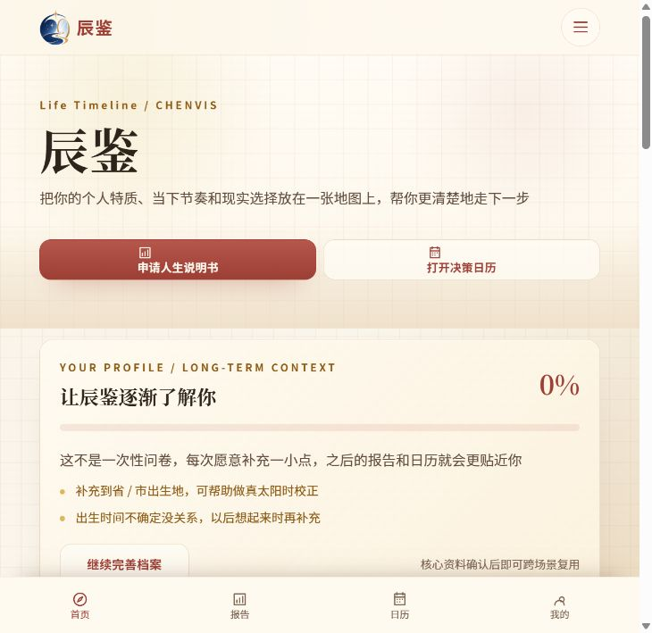

### 2.1 一期目标

1. 让用户完成账户与档案建立、人生说明书申请、阅读人工审核后的报告，并可基于该报告申请决策日历。
2. 为咨询师提供可追溯的 AI 辅助分析、人工判断修正、最终质量审核和报告交付工作流。
3. 让已交付报告成为日历生成的前置条件；日历 AI 生成成功后自动向用户开放。
4. 为管理员提供用户与咨询师运营、报告队列观察、生成任务排障和审计入口。

### 2.2 产品边界

- **已确认：报告必须申请并人工审核交付。**用户不能自助生成或查看未经咨询师修正的 AI 报告。
- **已确认：日历只能由已交付报告触发。**AI 生成完成后自动交付，不需咨询师或管理员人工审批。
- **已确认：日历收敛为一条产品流程。**用户不再从多个入口进入不同审核队列。
- 当前代码仍包含测评页直接生成报告、咨询师报告申请流、咨询师日历申请流和独立管理员日历审核流；这些现状与目标存在差距，见第 9 节。
- 旧预约、课程与服务介绍功能已从一期代码中移除，不纳入本期范围。
- 报告和日历的产品定位是理解与行动参考，不替用户作唯一决定；正式免责声明及医疗、心理、法律、财务等适用边界尚待 D9 确认。

## 3. 用户与角色

| 角色 | 主要目标 | 当前访问边界 |
|---|---|---|
| 普通用户 | 管理个人档案；提交人生说明书申请并跟踪进度；阅读已交付报告；基于已交付报告申请日历；查看日历并记录行动 | 只能访问自己的账号资料、申请、已交付报告、日历及行动记录；不得触发面向用户的自助报告生成 |
| 咨询师 | 处理报告申请；查看必要情境与依据；确认、修改或拒绝 AI 判断；编辑报告；请求补充；通过最终审核并交付 | 仅处理可接单或分配给自己的报告申请；通过有效服务申请分配关系读取必要用户资料。日历生成不进入其审核队列 |
| 管理员 | 监控运营；管理用户和后台成员；分配或关闭服务申请；观察报告与 AI 任务；查询审计活动；维护后台运营数据 | 管理端全局运营操作；不得把正常日历生成改成人工审批。咨询师工作区目前存在 API 阻断，详见第 9 节 |

后台成员通过管理员邀请进入系统。公开注册和密码找回使用短信验证码；登录使用手机号和密码。路由守卫限制运营中枢为管理员，咨询工作台为管理员或咨询师。

## 4. 信息架构

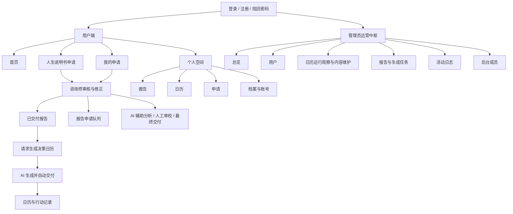

| 界面 | 当前路由 | 功能范围 |
|---|---|---|
| 首页 | `/pages/home/home` | 产品主入口、人生说明书与决策日历入口、用户导航 |
| 人生说明书 | `/pages/assessment/assessment` | 当前为个人档案、当次议题与直接报告生成；目标改为提交报告申请并查看申请结果 |
| 我的申请 | `/pages/requests/requests` | 目标展示人生说明书申请状态、补充要求/撤回，以及日历 AI 生成状态和结果入口；当前仍按报告/日历两类服务申请展示 |
| 日历申请表 | `/pages/requests/new` | 当前可单独创建或补充日历服务申请；目标改为仅从已交付报告发起 AI 日历生成 |
| 报告详情 | `/pages/report/detail` | 阅读个人报告内容 |
| 决策日历 | `/pages/calendar/calendar` | 月度节奏、日历详情、行动与决策记录；目标入口只允许基于已交付报告请求生成 |
| 个人空间 | `/pages/user/user` | 报告、日历、申请、档案及账号设置面板 |
| 关于辰鉴 | `/pages/about/about` | 产品定位、fi/te 结构和产品边界说明 |
| 咨询工作台 | `/staff` | 当前为工作人员申请收件箱和申请处理区；目标重点是报告专业审核、编辑与交付 |
| 运营中枢 | `/admin` | 管理总览及用户、日历运行观察/内容维护、报告/任务、日志、成员等运营区 |

## 5. 核心用户流程

### 5.1 账户与档案

1. 用户通过手机号和密码登录，或通过短信验证码完成注册、密码找回。
2. 首次进入测评时建立个人档案；已有档案的用户可确认或修改。
3. 核心出生资料包括称呼、性别、出生日期、历法类型和出生时间准确度；个人画像扩展项为选填。
4. 本次困惑和关系、身心等情境只用于当次申请，默认不并入长期个人档案。
5. 咨询师或管理员由管理员创建一次性邀请，受邀成员完成账号初始化。

### 5.2 人生说明书：申请后由咨询师审核交付

**第 1 步：提交申请**

- 用户确认个人基础资料，服务端保存档案并更新档案版本。
- 必填资料经过日期、历法和出生时间范围校验；可展开填写可选画像。
- 用户描述本次困惑或挑战，选择关注领域和期望结果，并可补充背景。
- 页面支持恢复未完成的表单草稿；提交后形成可跟踪的报告服务申请。

**第 2 步：AI 辅助生产与人工审核**

- 从 9 个关注领域中选择 1 至 3 项：事业、关系、家庭、财务、健康、人际、成长、子女教育、其他。
- 描述当前困惑或挑战；至少选择 1 项希望获得的结果。
- 可补充问题持续时间、影响程度、决策进度、惯用决策方式和其他背景。
- 支持沿用上次报告背景后编辑；本次表单内容作为本申请的输入快照。
- AI 负责形成分析与报告初稿；初稿仅供咨询师在工作台审核，不直接向用户开放。
- 咨询师核对依据，接受、修改或拒绝 AI 判断；资料不足时可以向用户请求补充。
- 咨询师确认修正完成后执行最终质量审核；通过后才可交付。

**第 3 步：交付与阅读**

- 报告交付后，用户在申请列表和个人空间看到已完成状态，并可打开完整报告。
- 报告内容包含个人基础、能量特质、事业建议、关系模式、个人成长与行动计划、总结等结构。
- 用户可从已交付报告详情进入日历生成入口，也可在个人空间回看历史报告。
- 报告最终交付版本不可被后续编辑覆盖；如需修订，应形成新的版本并保留已交付版本。

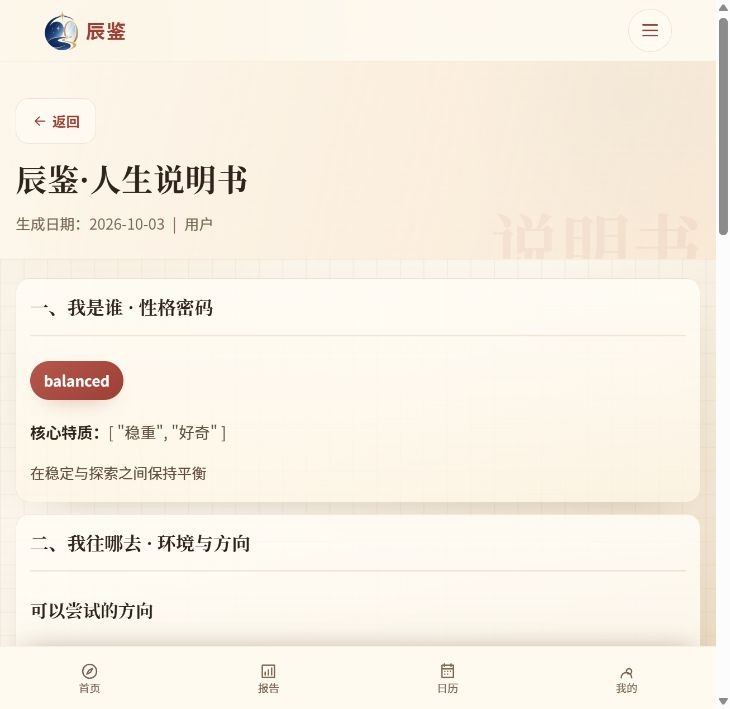

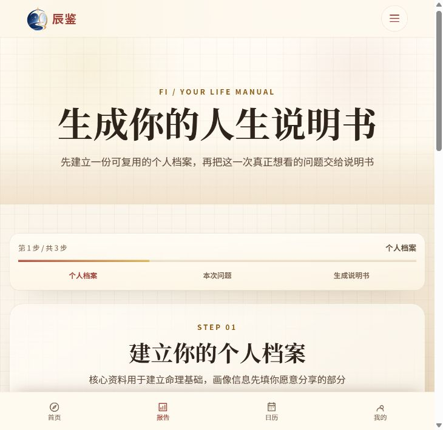

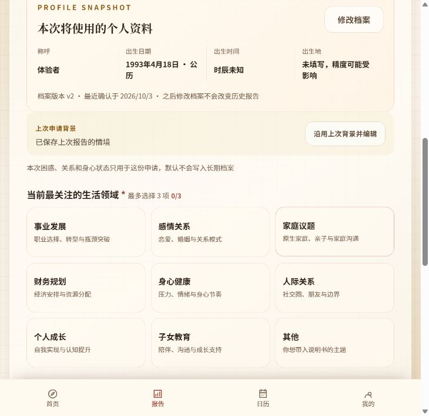

### 5.3 我的申请与咨询师工作台

用户在“我的申请”查看人生说明书申请及日历生成记录。报告申请列表展示服务类型、提交时间、进度、关注议题和补充要求；用户可按状态规则撤回申请或补交资料。日历生成成功后，入口应引导到对应日历，而不是另一套人工审核申请。

#### 咨询师处理链路

1. 咨询师从可接申请或已分配给自己的队列打开报告申请；管理员可负责分配和运营介入。
2. 工作台呈现申请资料、AI 分析草稿、报告片段、处理阶段和未解决质量问题。
3. 咨询师核实专业判断、修正叙述与建议；如果资料不足，注明需要补充的内容并退回用户。
4. 用户补充并重新提交后，申请回到待处理队列；原咨询师是否保留需由团队确认，见 D4。
5. AI 生成失败时，咨询师或有权限的管理员可按规则重试；不得把未审核初稿当作交付物。
6. 通过最终审核后生成交付版本，报告和申请进入只读状态，用户可查看。

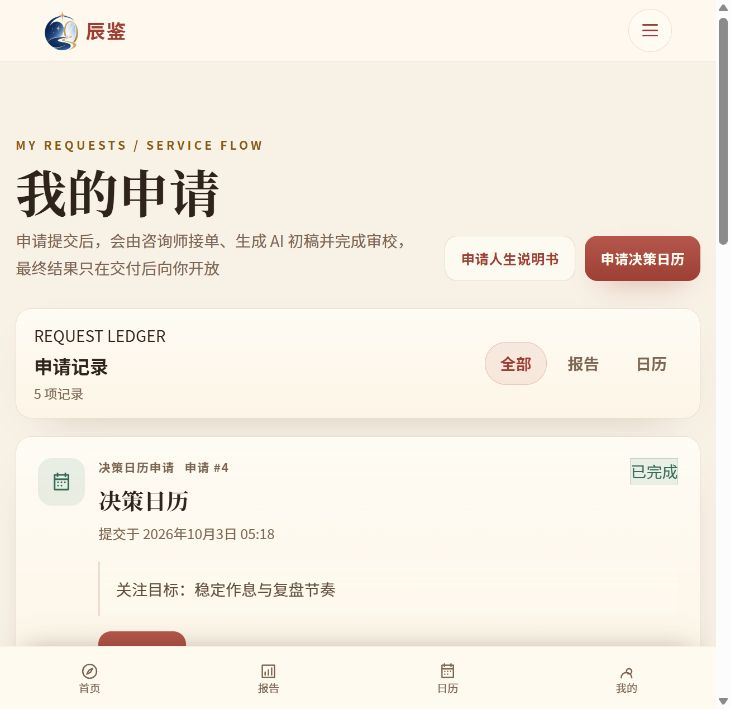

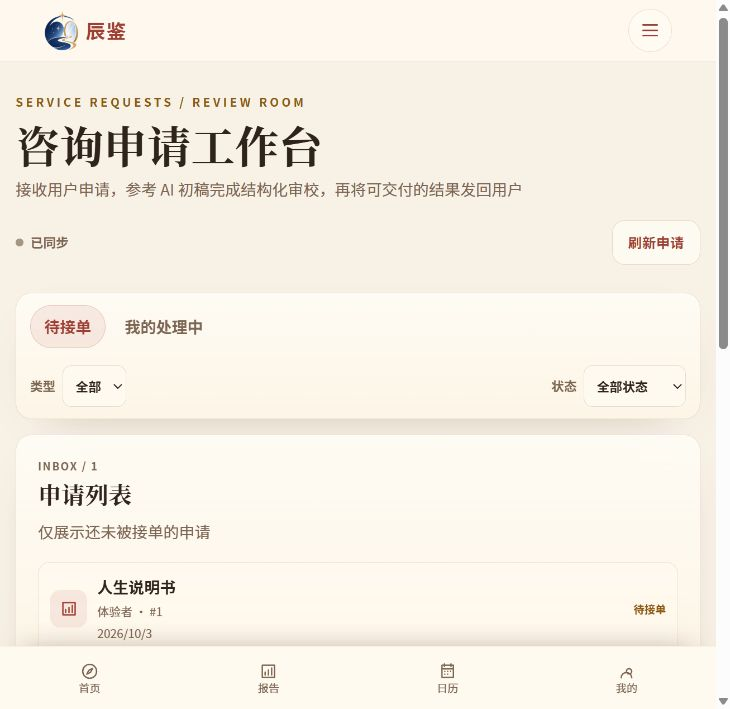

#### 咨询师工作台目标布局

参考架构附件中的审稿式三栏布局，工作台应让咨询师围绕证据和用户可读内容完成判断，不要求直接编辑底层结构化数据：

| 左栏：情境与依据 | 中栏：分析 / 报告正文 | 右栏：核心判断 |
|---|---|---|
| 用户问卷与本次问题；程序计算事实；已确认的上游结论；相互冲突或资料缺口提醒 | AI 草稿和报告片段；可编辑的正文；片段状态、修订记录；AI 局部重写与一致性操作 | Finding 核心判断；置信度；引用 Evidence；风险等级；接受、修改、拒绝、新增操作 |

咨询师工作台至少支持以下审核行为：

- 对普通判断可批量确认；低置信度、证据冲突、高风险和安全规则标记必须显式处理。
- 将“改变专业判断”的语义修改与“只调整表达”的文字修改区分记录；若无法可靠自动识别，保存时由咨询师选择修改类型。
- 支持重新生成、重新表达、降低确定性、提供替代解释、冲突检查、一致性检查、压缩和扩写等局部 AI 辅助操作。
- S1 至 S4 完成后进入报告叙事规划；咨询师选择 AI 提供的叙事候选，确认主题和重点，再审核分段写作结果。
- 最终审核区显示阻断项、警告、关键判断覆盖情况和重复风险；存在未解决阻断项时不能交付。
- 交付后固定版本只读，重新处理须产生新版本，并保留来源和修订追溯。

以上是附件参考后的目标设计，不代表当前工作台已提供这些布局、Finding 操作或 S0 至 S6 阶段控件。当前工作台 API 有阻断缺陷，现状见第 9 节。

**当前入口差距：**后端和工作台有 `report` 服务申请及审校数据契约；用户端测评当前直接生成报告，代码梳理未发现创建报告服务申请的正常入口。待补申请会带申请编号返回测评页，但测评页未读取该编号，也未更新或重提原申请。目标流程需要补齐“提交报告申请”和“同一申请补资料后重新提交”。

### 5.4 决策日历与用户记录

- **前置条件：**用户至少有一份已交付的人生说明书，并从该报告或关联日历空状态发起请求；用户选择或确认作为生成依据的已交付报告。
- **生成过程：**用户填写或确认日历周期、关注主题和目标后提交；系统调用 AI 生成日历内容。生成中可显示处理状态，但不进入咨询师或管理员审核队列。
- **交付规则：**AI 生成成功后将结果与来源报告关联，并立即向用户开放和展示；“即时交付”指生成完成即自动交付，不承诺尚未定义的固定秒数 SLA。
- **失败处理：**AI 生成失败时向用户显示可理解的失败状态和重试入口；失败重试与已成功交付版本分开记录，不由人工审核代替。
- **唯一入口：**日历页、报告详情、个人空间中的生成操作必须进入同一请求流程；未交付报告的用户看到申请人生说明书的引导，不提供单独生成日历的方式。
- 有已交付日历时，用户查看月度总览、阶段节奏、日期格和所选日期详情。
- 单日内容可展示节奏/标签、摘要、宜做与暂缓事项、时段提示等信息。
- 用户可以新增行动或决策记录，状态为进行中、已完成或跳过；已保存记录可删除，当前没有发现独立编辑已保存记录的操作。
- 记录优先与账户同步；日历记录 API 不可用时，当前实现会回退到此浏览器本地保存，跨设备可见性取决于保存来源。
- 没有已交付日历但已有已交付报告时，展示“生成决策日历”入口；没有已交付报告时，引导用户先提交人生说明书申请。
- 不保留独立的管理员审批入口或咨询师日历服务申请入口；旧入口按第 9 节所述属于当前代码与目标的差距。

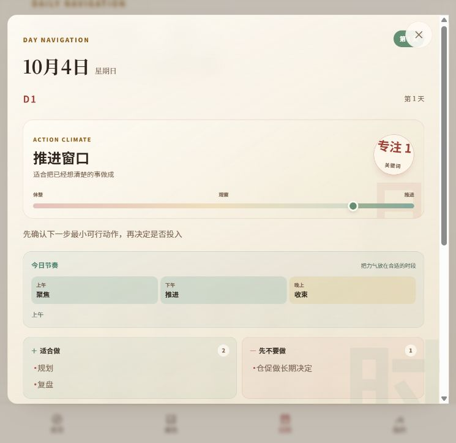

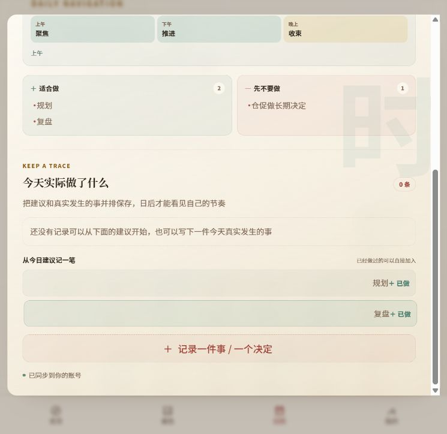

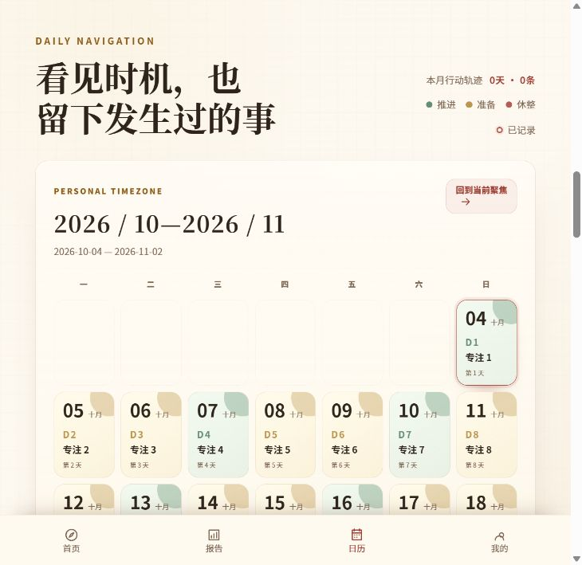

### 5.5 个人空间

个人空间聚合以下用户资产：

- **报告**：历史报告列表与详情入口。
- **日历**：当前及历史日历入口。
- **申请**：人生说明书申请及状态；日历生成状态和已生成结果入口。
- **个人档案/账号**：资料修改、密码等账户设置。

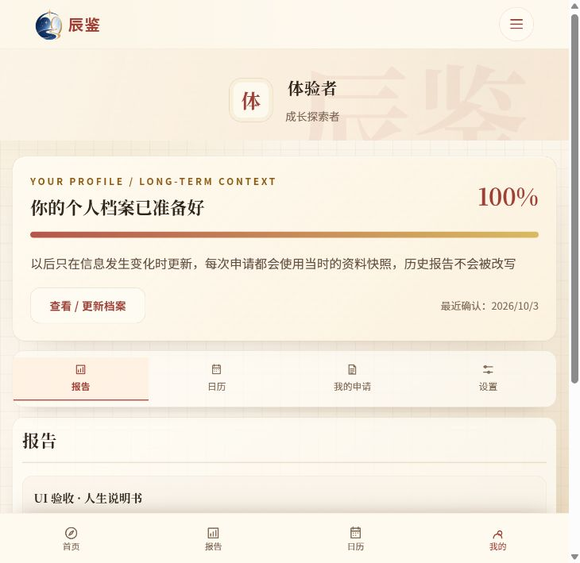

### 5.6 管理员运营

| 管理区 | 当前功能 |
|---|---|
| 总览 | 选择 7/30/90 天数据范围；查看用户、报告、任务、已发布日历和行动记录统计；查看业务趋势、待处理项、结构分布和最近活动；可自动刷新 |
| 用户 | 按姓名/手机号、角色、状态、注册时间查询；分页；查看用户详情及报告/日历摘要；修改角色、启停账号、密码重置；导出 CSV |
| 日历运行观察与内容 | 当前可查看、编辑、导入、发布或归档日历内容并查看行动记录；目标是不对每次用户的 AI 日历生成请求做人工审批 |
| 报告与任务 | 查询报告申请及 AI 生成任务；查看详情；按条件筛选和导出；符合条件的失败任务可重试；最终专业审核由咨询师完成 |
| 活动日志 | 查看审计活动与操作记录，并按可用条件筛选/导出 |
| 后台成员 | 创建咨询师/管理员邀请并查看现有成员；邀请令牌只在生成时展示 |

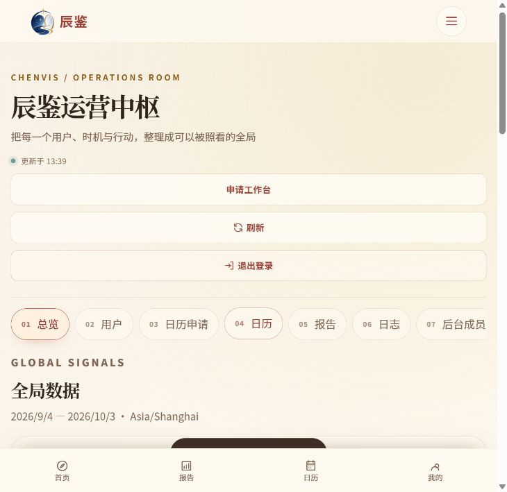

## 6. 申请状态与业务规则

### 6.1 人生说明书申请与交付

报告申请是需要人工专业审核的服务。下表状态值来自当前代码，用户含义和交付门槛按本 PRD 的目标规则解释：

| 状态 | 用户端含义 | 主要处理方/动作 |
|---|---|---|
| `submitted` | 等待受理 | 咨询师接单，或管理员分配 |
| `accepted` | 已受理 | 工作人员启动 AI 辅助分析与初稿 |
| `ai_processing` | 正在准备分析 | 后台生成任务处理中；用户只能看到进度，不可查看初稿 |
| `ai_ready` | 等待咨询师审核 | 咨询师打开分析与报告工作区 |
| `reviewing` | 咨询师审核中 | 咨询师核实、修正、请求补充或通过最终质量审核 |
| `needs_info` | 需要补充资料 | 用户补充并重新提交 |
| `failed` | 分析暂时失败 | 工作人员可按流程重试 |
| `delivered` | 报告已交付 | 用户查看通过人工审核的最终报告；交付版本只读，并开放日历申请入口 |
| `withdrawn` | 已撤回 | 用户可在 `submitted`、`needs_info` 状态撤回 |
| `rejected` | 暂未受理 | 管理员关闭/拒绝并给出原因 |

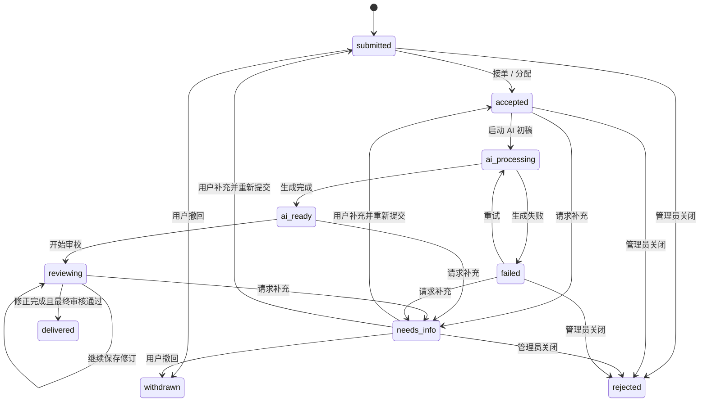

**权限与锁定规则：**用户只可维护自己的申请；撤回当前仅开放于 `submitted` 和 `needs_info`。咨询师仅能处理分配给自己的申请或可接单申请。用户报告、生成任务及相关资料的工作人员读取权限以有效分配关系为依据。AI 初稿对用户不可见；`ai_ready` 不得直接转为 `delivered`；必须经过 `reviewing` 和最终审核。交付后报告版本只读，任何后续更正形成新版本。

### 6.2 决策日历生成与交付

目标流程只有一条：

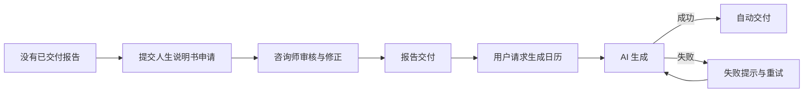

业务规则：

- 请求必须关联当前用户有权访问的一份已交付报告；报告未交付、已撤回或不属于该用户时不得启动生成。
- 生成参数可以包括日期范围、关注领域、用途和期望结果；具体周期等细节见 D7。
- AI 生成成功即自动创建/发布用户可读的日历版本并关联来源报告；流程中没有咨询师接单、人工审校或管理员审核状态。
- 生成失败可重试并保留失败记录；不能把失败伪装成已交付，也不能覆盖已有成功版本。
- 用户可以从报告详情、个人空间或日历空状态进入，但所有入口必须进入同一套前置校验和生成逻辑。

| 用户可见状态 | 条件 | 页面动作 |
|---|---|---|
| 暂不可生成 | 用户没有已交付报告 | 引导提交人生说明书申请 |
| 可生成 | 用户有可用的已交付报告，且尚未进入本次生成 | 展示“生成决策日历”入口 |
| 生成中 | AI 正在处理请求 | 展示处理中状态；不显示人工审核等待 |
| 已交付 | AI 生成成功 | 立即开放对应日历和日期内容 |
| 生成失败 | AI 任务失败 | 展示失败原因摘要和重试操作 |

**当前实现差距：**代码同时存在 `service_request` 的 `calendar` 类型（咨询师处理）和独立 `CalendarRequest`（管理员审核），后者当前状态为 `pending`、`reviewing`、`fulfilled`、`rejected`、`cancelled`。它们是现状模型，不是目标规则；需收敛为报告交付后的 AI 生成流程。

## 7. 功能需求清单

下表定义目标功能范围。P0/P1 是建议讨论顺序，不代表既有发布承诺；“当前基线”用于提示与目标的差异。

| 编号 | 功能 | 当前基线 | 建议优先级 |
|---|---|---|---|
| F-01 | 手机号账户与会话 | 登录、注册、找回密码、退出；工作人员邀请初始化 | P0 |
| F-02 | 个人档案维护 | 出生资料必填校验、可选画像、档案版本 | P0 |
| F-03 | 报告申请资料 | 多选关注领域、困惑描述、期望结果、可选背景、草稿恢复；提交后形成报告申请 | P0，当前缺少用户端申请入口 |
| F-04 | 报告 AI 辅助生产与人工交付 | AI 分析/写作初稿只在工作台可见；咨询师修正并通过最终审核后交付 | P0，当前有直接生成路径且工作区 API 有阻断缺陷 |
| F-05 | 申请状态与补充 | 报告申请列表、状态查看、用户补充资料、撤回和工作人员队列同步 | P0，报告补资料闭环缺失 |
| F-06 | 咨询师审核工作台 | 情境/正文/核心判断三栏；判断接受、修改、拒绝、新增；局部 AI 辅助；最终质量闸门 | P0，当前附件为设计参考，代码能力不完整 |
| F-07 | 已交付报告阅读 | 查看最终报告、历史列表、个人空间回看；不得暴露未审核初稿 | P0 |
| F-08 | 报告驱动的 AI 日历生成 | 必须选择已交付报告；单一入口；AI 成功后直接自动交付，无人工审批 | P0，当前存在两套人工处理路径 |
| F-09 | 日历与日常记录 | 月视图、日期建议、行动/决策记录 | P1 |
| F-10 | 用户自助空间 | 已交付报告、日历、报告申请、档案和账户面板 | P1 |
| F-11 | 管理员运营 | 总览、用户、日历运行观察/内容维护、报告任务、日志、成员邀请 | P1 |

### 7.1 一期端到端验收要点

- 用户完成档案和议题填写后，提交的是人生说明书申请；不得通过用户页面或公开 API 自助获得未经人工审核的报告。
- 申请进入咨询师队列；用户可以查看状态、收到补资料要求并补充原申请。
- 咨询师可以打开必要的情境、依据、核心判断和 AI 初稿，完成人工核实与修正；存在未解决的最终审核阻断项时不得交付。
- 只有咨询师最终审核通过的报告版本可以进入用户报告列表；交付后版本只读。
- 没有已交付报告时不能生成日历；有已交付报告时从任一 UI 入口都进入同一 AI 生成流程。
- 日历 AI 生成成功后自动直接交付并可立即查看，不要求人工接单、审批或审核；失败状态可辨认、可恢复，且不覆盖已交付版本。
- 用户可以查看日历日期内容，并按已确认的保存规则新增和回看行动/决策记录。
- 管理员可按角色访问运营区；报告、日历生成和交付活动均可追踪，未授权角色不能进入管理功能。

上述规则中报告人工审核交付、日历依赖已交付报告、日历 AI 自动交付、日历流程收敛和禁止自助生成报告均已确认；周期、补资料路由、撤回规则等剩余细节见第 10 节。

## 8. 非功能与体验基线

- **登录与访问控制**：业务页面/API 需要登录；路由按角色保护运营入口。刷新令牌保存在 HttpOnly Cookie，访问令牌保存在当前浏览器会话。
- **个人资料与问题分离**：档案资料作为长期账户资料；每次测评的困惑和关系/身心背景按当次上下文提交。
- **异步任务可观察**：报告 AI 初稿和日历 AI 生成均可查看状态；日历成功自动交付，失败可重试；管理员可观察失败并按权限执行受限恢复。
- **操作留痕**：报告申请受理、AI 生成、人工判断修正、最终审核、报告交付及日历生成/交付均可追溯；管理端提供运营查询。
- **可追溯修订**：报告草稿和判断修订可追溯；交付报告版本不可覆盖。日历生成留存来源报告与版本关系。
- **移动端页面**：用户端主要流程提供移动布局；管理台与工作台也能适配窄屏，但密集数据视图更适合桌面操作。

### 8.1 候选衡量信号

下列指标只用于产品评审讨论，当前没有约定目标值或统一口径：

- 报告申请提交到受理、受理到人工交付的时长；人工审核退回修改率、AI 初稿失败率、用户补资料比例。
- 报告交付后的阅读率和用户满意度；日历生成请求成功率、生成耗时、失败重试率及报告到日历的转化率。
- 已交付日历的查看频次，以及用户新增行动/决策记录的比例。
- 管理员总览中待处理事项数量和队列停留时长。

## 9. 已知问题与验证观察

本节描述本次梳理/本地运行观察到的事项，不构成新增产品需求。

| 级别 | 观察 | 对功能把控的影响 |
|---|---|---|
| 阻断 | 咨询师接单后读取申请工作区时，[`service_request_staff_routes.py`](../../backend/app/api/v1/service_request_staff_routes.py) 调用 `staff_can_access`，但该路由文件当前未导入该函数。演示环境实际出现工作区 API 500。 | 工作台无法进入申请详情，AI 初稿、人工审校和交付链路无法通过页面走完；在修复并回归前不可视作可交付流程。 |
| 报告流程冲突 | 测评页当前直接调用 `generateReportWithAI` 生成并展示报告；同时后端/工作人员端支持 `report` 服务申请与咨询师审校，但当前用户端未发现创建报告服务申请的正常入口。待补申请链接会携带申请编号跳转测评页，但测评页不读取该编号，也未更新/重提原申请。 | 当前用户路径违反“报告必须申请、人工审核修正后交付，禁止自助生成”的已确认规则；需将测评提交改为申请，并补齐原申请补资料闭环，同时限制公开生成能力。 |
| 日历流程重叠 | 当前 `service_request` 支持咨询师处理 `calendar` 类型申请；日历页还可创建独立 `CalendarRequest`，由管理员审核。 | 两条路径都不符合已确认的单一目标流程。应统一为“已交付报告 → 用户请求 → AI 生成 → 成功即自动交付”，无人工审核节点。 |
| 工作台设计差距 | 当前工作人员页提供申请队列、AI 初稿、结构化编辑及交付动作；未呈现附件所述的情境/正文/核心判断三栏 Finding 审核、来源证据和最终 QA 阻断项。工作区 API 当前另有 500 阻断。 | 咨询师端需先恢复工作区可用，再评估分阶段专业判断审核和最终报告闸门的产品化范围；不能把附件中的目标界面当作当前能力。 |
| 验收数据契约 | 本地 UI 验收夹具中的报告 `core_traits` 为数组，而报告列表当前期望字符串；该夹具导致个人空间加载失败。为截图只调整了隔离的演示数据库记录，没有修改仓库业务代码。 | 这是夹具与接口契约的核对项；需确认生产历史数据是否可能出现相同结构，再判断产品影响。 |

## 10. 已确认规则与待团队定义

### 10.1 已确认规则

| 决策 | 结论 | 对应目标流程 |
|---|---|---|
| D1：日历流程收敛 | 不允许单独生成日历；日历必须以一份已交付人生说明书为前置条件。用户提交生成请求后，由 AI 生成并在完成时直接交付，不经过咨询师或管理员人工审核。 | `已交付报告 → 用户请求 → AI 生成 → 自动交付` |
| D2：报告不允许自助生成 | 用户必须先提交人生说明书申请；AI 只生成供咨询师使用的初稿；咨询师审核并修正后通过最终审核，才能交付给用户。 | `用户申请 → AI 初稿 → 咨询师审核修正 → 最终审核 → 用户交付` |

以上规则是当前 PRD 的产品基准。旧代码中直接报告生成和两类日历人工处理记录用于描述差距，不构成继续保留这些用户流程的依据。

### 10.2 待团队补充的细节

| 编号 | 待决策问题 | 当前代码事实 | 需要确认的结论 |
|---|---|---|---|
| D3 | 报告申请表单与补资料体验如何设计？ | 现有测评包含档案、关注领域、困惑和期望结果；待补链接未接回原申请 | 确认必填/选填字段、用户补资料是否复用原表单、草稿保存与再次提交提示 |
| D4 | 补充资料后如何回到工作队列？ | 服务端已有分配时回 `accepted`，无分配时回 `submitted` | 确认是否优先回到原咨询师、管理员何时需要重新分配，以及向用户展示的预计处理时间 |
| D5 | 报告申请关闭与撤回规则是什么？ | 用户当前只可在 `submitted`、`needs_info` 撤回；管理员可关闭/拒绝 | 确认各状态的撤回、关闭、重开规则及用户端原因文案 |
| D6 | 日历后台内容维护的边界是什么？ | 管理员现有日历内容编辑、导入、发布/归档能力；独立申请审核与内容维护并存 | 确认保留哪些运营维护能力、如何处理异常内容；常规 AI 生成请求不得设置人工审核 |
| D7 | 日历周期、重复生成和时效标准是什么？ | 当前日历申请说明生成起始日起 30 天；任务状态为异步 | 确认 30 天是否唯一周期、续期/重新生成策略、进度展示和目标生成时长。此项不改变 AI 成功后自动交付的规则 |
| D8 | 行动记录以什么方式保存与维护？ | API 可用时同步到账户；读取/写入异常时回退到浏览器本地；当前提供新增和删除 | 确认是否要求跨设备一致、是否保留本地回退、是否支持编辑已保存记录 |
| D9 | “辰鉴参考”内容应如何说明适用边界？ | 产品定位不做预测；页面有行动参考语义 | 定义报告/日历免责声明、AI 生成提示、适用场景和危机信息处理策略 |
| D10 | 运营指标的口径与告警阈值是什么？ | 管理总览展示账户、报告、任务、日历、行动记录及趋势 | 定义活跃用户、报告人工交付时长、日历生成成功率、待处理项和异常阈值口径；截图中的数值仅为演示数据 |

## 11. 截图索引

截图为本地运行界面，采用窄屏浏览器视口；总览图主要展示页面首屏。页面内容随账户数据和当前代码变化，均展示当前实现，不是本轮目标改版稿。咨询师截图只展示收件箱；工作区 API 500 时无法取得完整工作区截图，因此目标三栏审稿体验以第 5.3 节结构表和附件设计原则说明。

| 截图 | 对应流程 |
|---|---|
| [01 首页](images/01-home.png) | 用户端首页入口 |
| [02 档案步骤](images/02-assessment-profile.png) | 当前测评第一步；目标报告申请资料之一 |
| [03 本次议题](images/03-assessment-context.png) | 当前测评第二步；目标报告申请资料之一 |
| [04 我的申请](images/04-my-requests.png) | 用户申请列表 |
| [05 补资料与失败状态](images/05-request-needs-info-and-failed.png) | 申请异常/补充状态 |
| [06 报告详情](images/06-report-detail.png) | 报告阅读 |
| [07 日历日期详情](images/07-calendar-day-detail.png) | 单日建议 |
| [08 行动记录](images/08-calendar-action-records.png) | 用户记录操作 |
| [09 日历月视图](images/09-calendar-month.png) | 月度节奏 |
| [10 个人空间](images/10-personal-space.png) | 用户资产入口 |
| [11 咨询师收件箱](images/11-consultant-inbox.png) | 当前申请接单入口；不代表目标三栏审核工作区 |
| [12 管理员总览](images/12-admin-overview.png) | 运营中枢首屏 |

## 12. 自评与补充记录

本轮更新后按“流程完整性、角色责任、决策一致性、现状/目标区分、验收可执行性、视觉材料可读性”复核：

- 报告流程明确从用户申请开始，AI 初稿仅在工作台使用，咨询师修正和最终审核后交付；禁止用户自助生成已写入边界和验收条件。
- 日历流程明确要求已交付报告，所有用户入口汇入同一 AI 生成流程，成功后直接交付且没有人工审核节点；失败恢复与已有版本保护也已列出。
- D1（日历流程收敛）和 D2（报告禁止自助生成）已列为已确认规则，不再出现在待团队定义清单。
- 用户、咨询师、管理员的工作边界与当前能力差异已分别列明；附件工作台设计转成可讨论的三栏、判断操作、局部 AI 能力和最终 QA 规则，并明确标注为目标设计。
- 关键状态、补资料、撤回/关闭、权限、交付只读和实现阻断已可对照；尚未确定的周期、队列分配、记录保存等被限制在开放问题中。
- 现有 12 张本地运行截图已逐一索引并标明是当前实现；工作台截图仅展示收件箱，三栏目标体验由结构表表达，避免让团队误认其已经存在。

复核后保留的讨论项只涉及实现与运营细节（D3-D10），不改变本轮已确认的报告和日历主流程。工作区 API 500 及现有入口差距属于代码实现风险，已列入第 9 节，不会被 PRD 目标描述掩盖。
