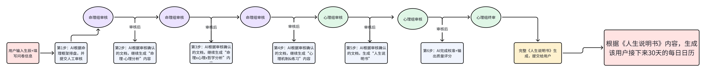

# 产品分析框架

## 辰鉴·人生说明书生成SOP（用于理解工作流）

## 核心总领\(可以同时给ai，让它谨记主旨）

命理为表，心理为里，哲学为根。不是算命，而是帮用户**看见自己内在的运行模式**——那些驱动行为、制造冲突、形成重复模式的底层心理结构，并借助中国传统哲学与荣格自性化理论，走向更完整、更自由、更真实的自性。

荣格:当内在的东西没被看见，它就会成为你的命运

命理来帮助看见这些东西\(潜意识）

|层级|名称|用户感知|核心问题|
|---|---|---|---|
|**意识层**|心理倾向层 / 人格面具|"我知道自己是这样的人" |我如何理解世界？我习惯怎么反应？|
|**潜意识层**|深层驱动层 / 阴影与情结|"原来我是这样的人"|什么在暗中驱动我？我为什么总是卡在同一件事上？|

**两层关系**：意识层是"显化的心理操作系统"，潜意识层是"底层的心理源代码"。产品要让用户从"知道自己的行为"深入到"理解行为背后的驱动程序"，最终完成对立面的整合，走向自性。

## 第一步：命理看盘（AI分析框架）

> 目标：完成命理层面的基础分析，为后续心理映射提供能量结构和场景依据。
> 审核节点：写完给人工进行第一次审核。
>
>

### 1\.1 八字全看

**AI分析框架（指令级prompt）**：

请按以下顺序分析八字命盘，每一步给出明确的命理判断和心理线索提示：

1. **日主定性**

    - 日干是什么？（甲乙丙丁戊己庚辛壬癸）

    - 日主的五行属性与阴阳属性，这种属性代表一种怎样的力?

    - 日主在十干中的基本特质：如甲木为参天大树（向上、独立、有主见），乙木为花草藤蔓（柔韧、依附、善变通）。

    - **心理线索**：日主代表命主的"自我核心"，是人格面具的根基。

2. **格局判定**

    - 身强 / 身弱 / 从格 / 化格？

    - 判断依据：月令\+ 全局生扶/克泄耗力量对比。

    - 身强：能量充沛，宜泄宜克，忌再补。

    - 身弱：能量不足，宜生宜扶，忌再泄耗。

    - 从格：极端格局，顺势而为，不可逆势。

    - **心理线索**：身强身弱决定命主的"自我强度"与"应对模式"——身强者边界清晰但可能沉浸自我世界不善适应环境；身弱者适应性强但容易自我怀疑缺乏主体性。

3. **月令分析**

    - 月支是什么？月令对日主的生克关系？

    - 月令十神是什么？（正官/七杀/正印/偏印/正财/偏财/食神/伤官/比肩/劫财）

    - 月令决定命局的"气候"与"能量基调"。

    - **心理线索**：月令是"世界安不安全"的原始编码，决定命主的底层世界观。

4. **十神分析**

    - 天干透出哪些十神？（显性心理特质）

    - 地支藏干有哪些十神？（隐性心理特质）

    - 哪些十神旺相？哪些十神衰弱/缺失？

    - 十神之间的生克关系（如食伤生财、财坏印、官杀混杂等）。

    - **心理线索**：

        - 旺相十神 = 命主习惯依赖的心理资源与防御模式。

        - 衰弱/缺失十神 =命主不善主动调用，回避的部分。

        - 十神交战 = 内在心理冲突的命理表现。

5. **日支\(人生观）分析**

    - 日支是什么？对日主的生克关系？

    - 日支十神是什么？

    - **心理线索**：日支是"我该如何存在"的内在脚本，代表命主内心最真实的需求模式。

6. **时支（未来发展方向/价值观）分析**

    - 时支十神、五行属性。

    - **心理线索**：时支代表"什么值得追求"的底层排序，是命主的价值观锚点。

7. **年柱（祖辈/集体无意识/早期印记）分析**

    - 年干、年支十神。

    - **心理线索**：年柱承载祖辈影响与集体无意识的早期印记，往往塑造命主最初的"内在权威"模板。

8. **刑冲合害分析**

    - 地支有无六冲、三刑、六合、三合、三会？

    - 天干有无合化、相克？

    - **心理线索**：

        - 冲 = 冲突断裂，突然激活的内外矛盾。

        - 刑 = 内耗自我惩罚，反复卡住的重复模式。

        - 合 = 融合、依附、捆绑的心理关系模式。

        - 害 = 暗中的伤害与隐秘的敌意。

9. **大运分析**

    - 当前大运干支、十神、五行属性。

    - 大运对原局的生克关系（助身/泄身/克身/生身）。

    - 当前大运是命主的"能量顺境"还是"能量逆境"？

    - **心理线索**：大运是人生的"能量气候"，顺境时人格面具运作顺畅，逆境时阴影与情结容易浮现。

10. **用神与喜忌**

    - 根据格局判定用神（对命主有利的五行/十神）。

    - 喜神（辅助用神）与忌神（对命主不利）。

    - **心理线索**：用神代表命主可以"正向运用"的心理资源；忌神代表容易陷入的耗能模式。

> **参考古典著作方向**（不直接抄书，作为分析深度参考）：
>
> - 《滴天髓》：五行气象、体用关系、清浊纯杂。
>
> - 《三命通会》：十神性情、格局变化、神煞辅助。
>
> - 《子平真诠》：格局成败、用神取用、行运喜忌。
>
>

### 1\.2 紫微重点宫位分析

**AI分析框架（指令级prompt）**：

紫微斗数只看三个重点宫位，其余宫位通过问卷情况人工判断如何调用

1. **命宫（人格面具与自我认同）**

    - 命宫主星和星曜组合

    - 主星的基本性格原型。

    - 主星能量强弱:命宫有无煞星（擎羊、陀罗、火星、铃星）？有无吉星（左辅、右弼、文昌、文曲、天魁、天钺）？

    - 命宫三方四正（命宫\+财帛\+官禄\+迁移）的整体气象。

    - **心理线索**：命宫是命主"戴上的人格面具"，是自我认同的核心。主星决定面具的"材质"，煞忌决定面具下的"裂痕"。

2. **身宫（人生下半场/后天努力方向）**

    - 身宫所在宫位？（可能与命宫同宫，或分居）

    - 身宫主星及星曜组合。

    - 身宫与命宫的关系：一致还是背离？

    - **心理线索**：

        - 命宫=先天设定；身宫=后天走向。

        - 命身同宫 = 先天后天一致，人生主线清晰。

        - 命身分离 = 人生上半场与下半场可能有主题转换，存在"转型期"的心理张力。

3. **福德宫（精神底色/内在小孩）**

    - 福德宫主星是什么？

    - 有无化忌？（化忌=执念、内耗、难放松）

    - 有无空劫？（空劫=虚无、抽离、精神飘）

    - 有无煞星？（煞=焦虑、恐惧、强迫式思考）

    - **心理线索**：

        - 福德宫是命主的"精神世界后台"，是内在小孩居住的地方。

        - 命宫 vs 福德宫 = 人格面具 vs 内心真相的张力。

        - 化忌宫位 = "你最在意的地方"，不是"你最倒霉的地方"。

4. **四化飞化（心理投射方向）**

    - 化禄、化权、化科、化忌的飞化路径。

    - 特别关注：化忌飞入哪个宫位？形成什么心理执念？

    - **心理线索**：四化飞化 = 心理能量的"流向地图"，化忌的终点往往是命主反复投射的情结点。

---

## 第二步：命理\-心理对应（AI分析框架）

> 目标：将命理信息翻译为心理语言，解读表面性格之下的阴影与情结。
> 审核节点：写完给人工进行第二次审核。
>
>

### 2\.1 核心对应原理

**阴影通过情结表现**。情结是阴影在现实中的"显影"——当某个未被整合的心理面向（阴影）被外界事件触发时，情结就被激活，表现为强烈的情绪反应、重复的行为模式或强迫性思维。

**命理\-心理映射的双层结构**：

|命理层面|心理层面（意识层）|心理层面（潜意识层）|
|---|---|---|
|日主 \+ 透干十神|人格面具（Persona）|自我认同的显性脚本|
|月令 \+ 日支|世界观 \+ 人生观|底层信念系统|
|地支藏干 \+ 未透十神|阴影（Shadow）|被排斥的心理面向|
|十神交战 \+ 刑冲|内在冲突|情结（Complex）|
|化忌飞化 \+ 煞忌分布|执念流向|强迫性重复模式、防御机制和模式|
|用神 \+ 喜神|正向心理资源|可激活的潜能（被压抑的真实能量，阴影能量的正向面）|
|忌神 \+ 失衡十神|耗能模式|需要觉察的陷阱|

### 2\.2 十神\-荣格心理学对应表

|十神|命理含义|心理机制|荣格概念映射|意识层表现|潜意识层表现（阴影）|
|---|---|---|---|---|---|
|**正印**|生我者，保护、学识、安全感|内在安全系统；用知识/思考建立心理防御、维护内在心理稳定 内在安全系统的滋养者。 通过知识、思考与智慧，建立稳定的内在安全基地。它让你在动荡中仍能回归内心，用学习与理解滋养自我，培养对自己的慈悲与接纳。这是Fi自我关怀的根基——你值得被自己温柔对待。|母性原型（Great Mother） |好学、稳重、有涵养、重视精神生活|过度依赖"知道"来逃避行动；用"想太多"回避现实；印旺为忌=回避型应对|
|**偏印（枭神）**|偏门学识、独特思维、疏离|异类感；用独特视角维持心理距离 心理机制：独特视角的守护者。 用非主流的思维与疏离感，保护你真实的自我不被外界吞没。它赋予你另辟蹊径的洞察力，让你在人群中保持独立判断。这是Fi独立人格的体现——你不需要迎合，你的不同就是价值。|智者原型（Wise Old Man）的阴暗面|思维独特、有创造力、不喜随大流|孤僻、多疑、难以信任他人；偏印无制=偏执型防御|
|**正官**|克我者，规则、责任、秩序|超我（Superego）的外化；内化社会规范 心理机制：内在秩序的建构者。 将社会规范与责任内化为个人价值体系，形成自律与担当。它不是压迫，而是你主动选择的“正确生活”的框架。这是Fi对意义与秩序的追求——你用自己的方式，活出值得尊重的人生。|父性原型（Senex）的阳性面 |自律、守规矩、有责任感、重视名誉|僵化、压抑自我、害怕犯错；官杀重=内在严厉父母|
|**七杀（偏官）**|偏门压力、危机、攻击性|威胁感知系统；战斗或逃跑反应 心理机制：逆境中的勇气之源。 将压力、危机与攻击性转化为成长的燃料。它让你在挑战面前不退缩，敢于直面恐惧，并在战斗中确认自己的力量。这是Fi在逆境中坚守价值的勇气——你比自己想象的更坚韧。|阴影中的攻击性面向 |有魄力、敢冒险、抗压能力强|暴力倾向、过度防御、被害妄想；七杀无制=冲动型防御|
|**正财**|我克者，稳定收入、务实、占有欲|物质安全感；通过掌控外物建立自我价值 心理机制：务实的安全感创造者。 通过稳定的努力与占有，为自己和家人创造物质安全。它让你脚踏实地，用行动兑现承诺。这是Fi对稳定与责任的表达——你值得拥有安稳的生活，也有能力守护你所爱。|阿尼玛/阿尼姆斯的世俗面 |务实、节俭、重视物质基础|吝啬、占有欲强、用物质填补情感空洞；财旺身弱=用忙碌掩盖空虚|
|**偏财**|偏门财、投机、社交、风流|欲望与享乐的驱动力；通过外部刺激获得快感；对商业本质的洞察，对小众机会的把握 心理机制：生命丰富性的体验者。 对机会的敏锐、对社交的享受、对新鲜体验的渴望，都是生命力的展现。它让你灵活应变，享受世界的多彩。这是Fi对自由与体验的向往——你可以在流动中保持真实，在冒险中收获成长。|狄奥尼索斯原型|善于社交、慷慨、有商业头脑|纵欲、投机、情感不专一；偏财过旺=成瘾性防御|
|**食神**|我生者，表达、才华、享受|自我表达与创造力的出口 心理机制：创造与滋养的出口。 通过表达、才华与享受，将内在世界转化为可分享的美好。它让你在创造中找到喜悦，也让他人因你而温暖。这是Fi的创造性表达——你的感受值得被听见，你的才华值得被绽放。|普绪喀原型（心灵）|温和、有才华、懂得享受生活|懒散、逃避责任、过度自我安慰；食神过旺=退行型防御|
|**伤官**|偏门表达、叛逆、批判、创新|反抗权威的驱动力；通过否定他者确立自我 心理机制：真实自我的捍卫者。 用批判、叛逆与创新，挑战不合理的权威与陈规。它让你不盲从，敢于说出真相。这是Fi对自我真实的坚守——你可以温柔，但绝不沉默。|捣蛋鬼原型（Trickster） |聪明、有创意、敢于挑战权威|刻薄、叛逆、伤人伤己；伤官见官=自我毁灭型冲突|
|**比肩**|同我者，自我、独立、竞争|自我边界维护；通过与他人比较确立自我价值 心理机制：健康边界的建立者。 通过独立、竞争与自我肯定，确立清晰的自我边界。它让你在关系中既不依附，也不控制。这是Fi的自主性——你尊重自己的独特性，也尊重他人的不同。|英雄原型的竞争面|独立、自信、有主见、自尊心强|固执、自私、难以合作；比劫过旺=自恋型防御|
|**劫财**|偏门同我者，争夺、冒险、行动力|生存竞争本能；资源争夺的原始驱动 心理机制：生命力的勇敢表达。 在资源争夺与冒险行动中，展现原始的生存本能与行动力。它让你敢于争取、敢于冒险、敢于活出张力。这是Fi对生命热情的释放——你有权为自己而战，也有能力创造丰盛。|阴影中的掠夺面向 |行动力强、敢冒险、有魄力|冲动、掠夺性、不顾他人；劫财无制=过分好斗倾向 |

### 2\.3 紫微星曜\-心理原型对应表

|主星|人格面具特征|阴影面向|情结触发点|
|---|---|---|---|
|**紫微**|领导者、自尊高、有主见|傲慢、独裁、难以接受批评|"我必须是最优秀的"完美主义情结|
|**天机**|聪明、善谋略、多思多虑|多疑、善变、缺乏安全感|"世界充满变数"的焦虑情结|
|**太阳**|热情、慷慨、喜欢付出|过度付出后的 resentment、燃烧殆尽|"我必须照亮别人"的救世主情结|
|**武曲**|务实、坚毅、重视成果|冷漠、功利、情感隔离|"只有成果才有价值"的成就情结|
|**天同**|温和、随和、追求安逸|懒散、逃避、缺乏主见|"只要不冲突就好"的和平主义情结|
|**廉贞**|感情丰富、执着、有原则|极端、占有欲、自我折磨|"爱就要完全占有"的执念情结|
|**天府**|稳重、保守、善于管理|固执、守旧、害怕改变|"改变就会失去"的控制情结|
|**太阴**|温柔、细腻、重视感情|情绪化、依赖、多愁善感|"我必须被需要"的依附情结|
|**贪狼**|多才多艺、欲望强、善交际|贪婪、不专一、纵欲|"永远想要更多"的匮乏情结|
|**巨门**|善于分析、口才好、洞察力强|多疑、刻薄、言语伤人|"真相必须被说出来"的批判情结|
|**天相**|重视形象、乐于助人、有品位|虚荣、过度在意他人评价|"我必须看起来很好"的形象情结|
|**天梁**|善良、有使命感、喜欢助人|说教、自我牺牲、道德绑架|"我是来拯救世界的"的救世主情结|
|**七杀**|果断、有魄力、敢于冒险|冲动、暴力倾向、孤独|"只有战斗才能生存"的生存情结|
|**破军**|开创、变革、不拘一格|破坏、不稳定、难以持久|"旧的必须被摧毁"的毁灭情结|

### 2\.4 阴影与情结的命理识别

**AI分析框架（指令级prompt）**：

请根据第一步的命理分析，按以下框架识别命主的阴影与情结：

1. **识别人格面具（Persona）**

    - 八字：日主 \+ 透干最旺的十神 = 命主习惯呈现给世界的"角色"。

    - 紫微：命宫主星 \+ 迁移宫 = 社会面具的核心特征。

    - 判断：命主在什么情境下感到"这才是我"？那就是人格面具运作的时刻。

2. **识别阴影（Shadow）**

    - 八字：

        - 缺失的十神 = 被完全排斥在"我"之外的面向。

        - 受克最严重的十神 = 被压抑、被否定的面向。

        - 藏干中旺但天干不透的十神 = "我知道但不愿承认"的面向。

    - 紫微：

        - 福德宫中的煞忌 = 内心不敢直视的恐惧与执念。

        - 命宫与福德宫的"背离" = 表面与内心的分裂程度。

    - 阴影不等于缺点，可能是：攻击性、边界感、欲望、休息的需要、脆弱、游戏性、独立判断。

3. **识别情结（Complex）**

    - 情结 = 阴影被触发时激活的"情绪\-认知\-行为"自动反应链。

    - 八字识别法：

        - 月令十神 = 人生反复出题的"题型"。

        - 十神交战（如财坏印、伤官见官）= 内在冲突形成的情结核心。

        - 刑 = 反复内耗的情结；冲 = 突然爆发的情结。

    - 紫微识别法：

        - 化忌飞入的宫位 = 执念的情结核心。

        - 煞忌聚集的宫位 = 最容易触发情结的人生领域。

    - 情结的典型表现：

        - "每次遇到X，我就会Y"的强迫性重复。

        - 对某类人或情境的过度敏感。

        - 明知不该但无法控制的反应模式。

4. **阴影→情结的激活路径**

    - 描述命主的"触发→阴影浮现→情结激活→防御反应→结果→重复"循环。

    - 示例模板：

        - 触发事件：\[具体命理触发，如大运冲日支、流年引动化忌\]

        - 阴影浮现：\[被压抑的十神/星曜面向\]

        - 情结激活：\[核心情绪，如恐惧、羞耻、愤怒\]

        - 防御反应：\[命主习惯的应对方式\]

        - 结果：\[短期缓解但长期维持模式\]

        - 重复：\[下一次遇到类似情境，循环再次启动\]

5. **权威内化与超我分析**

    - 八字：官杀 \+ 印星 = 权威内化的心理结构。

    - 紫微：父母宫 = 权威原型的具象化。

    - 判断命主内心的"应该、必须、不能"来自哪里？

    - 成熟方向：完成"主权交接"——外部规则变成自己可以选择、修改、拒绝的原则。

---

## 第三步：命理×心理×哲学 三重自性化整合（AI分析框架）

> 目标：将命理时序、心理成长、东方哲学融为一体，为用户绘制自性化路线图。
> 审核节点：写完给人工进行第三次审核。
>
>

### 3\.1 自性化的核心理解

**自性化（Individuation）**不是更优秀、更乖、更好、更强大，而是**更完整、更自由、更真实**。

**走向自性不是回到原点，而是找到z轴，在z轴上螺旋式上升**——不是在二维平面内反复徘徊，而是在三维维度里整合对立面，实现人格的纵向提升。

### 3\.2 英雄原型分区（集体无意识参考）

将命主放入荣格英雄原型的四象限地图，帮助其理解自己在人类集体无意识中的"位置"：

|象限|英雄原型|核心特质|命理特征|偏态|自性化任务|
|---|---|---|---|---|---|
|**第一象限**|战神与征服者|行动、竞争、征服、秩序|官杀旺、比劫强、食伤制官杀|过度行动/征服|收剑入鞘，允许残缺与休息|
|**第二象限**|孤独的普罗米修斯|知识、洞见、创造、独立判断|印旺、食伤旺、财星弱|精神自主变孤傲|降维着陆，以身入局|
|**第三象限**|消极避世者|退回内在、依附母体、思虑想象|印枭旺、食伤受制、官杀弱|思虑/退避变封闭|劈开母体，开始做功|
|**第四象限**|异化物化服从者|角色、规则、评价、组织位置|财官旺、印为忌、比劫弱|角色/评价压过主体|找回脊梁与主权|

**AI判断方法**：根据八字十神旺衰 \+ 紫微命宫/福德宫主星 \+ 身宫位置，综合判定命主的原生象限。

### 3\.3 人生时序与自性化阶段

**AI分析框架（指令级prompt）**：

请结合以下三个维度，为用户绘制"人生时序\-自性化阶段"地图：

1. **八字大运周期**

    - 当前大运的十神属性 = 当前人生的"能量主题"。

    - 大运与原局的刑冲合害 = 当前阶段的"触发事件类型"。

    - 喜用神大运 vs 忌神大运 = "顺境展开面具" vs "逆境阴影浮现"。

    - **自性化规律**：顺境时人格面具运作顺畅，是积累资源期；逆境时阴影与情结浮现，是整合转化期。

2. **易经时序智慧**

    - 参考用户当下境遇和以上分析内容选出适合用户的卦象

    - 用卦象的"时义"解读当前人生阶段的主题。

    - **哲学线索**：

        - "时止则止，时行则行"——随顺时势，不逆势而为。

        - "穷则变，变则通，通则久"——逆境是转变的契机。

        - "天行健，君子以自强不息"——自性化的内在动力。

3. **荣格自性化阶段**

    - 第一阶段：人格面具期——认同社会角色，追求外在成就。

    - 第二阶段：阴影遭遇期——阴影浮现，经历内在冲突与危机。

    - 第三阶段：对立面整合期——接纳阴影，整合阿尼玛/阿尼姆斯。

    - 第四阶段：自性达成期——超越对立，找到内在的统一与完整。

    - **判断命主当前处于哪个阶段**：

        - 若当前大运顺遂、面具运作良好 → 第一阶段或第四阶段。

        - 若当前大运动荡、内在冲突剧烈 → 第二阶段或第三阶段。

4. **大运与自性化任务的对应**

    - 用神大运：发挥优势、积累资源、展现面具的最佳时期。

    - 忌神大运：阴影浮现、情结激活、必须面对内在冲突的时期。

    - 转换大运（前后运交接）：人生主题转换、旧面具脱落、新自我萌芽的关键时期。

    - **产品呈现**："接下来的X年，你的人生主题是XX。这不是'好运'或'坏运'，而是你的自性化旅程进入了XX阶段。"

### 3\.4 个体无意识与集体无意识的桥梁

一些著作可以参考:

荣格核心理论提出的著作:《红书》《自我与自性》

**参考《金花的秘密》的整合视角**：

- 八字的"命"不是宿命，而是**先天的能量配置**——如同金花的"种子"。

- 大运的"运"不是运气，而是**能量流转的节律**——如同金花的"生长周期"。

- 自性化的工作不是"改变命运"，而是**让先天的种子在合适的时机以完整的方式绽放**。

**参考《道德经》的智慧**：

- "知人者智，自知者明"——命理分析是"知人"，心理觉察是"自知"。

- "反者道之动"——阴影的转化不是消灭，而是反向运动中的整合。

**参考《了凡四训》的实践**：

- "命由我作，福自己求"——命理是起点，不是终点。

- "从前种种，譬如昨日死；从后种种，譬如今日生"——自性化是持续的"心理重生"。

- 结合命主的八字用神，给出"改过迁善"的具体方向（不是道德说教，而是能量优化）。

### 3\.5 三重整合的命理\-心理\-哲学对应

|命理|心理|哲学|
|---|---|---|
|八字格局（先天配置）|人格结构（意识\+潜意识）|"天命之谓性"（《中庸》）|
|大运流年（时序变化）|自性化阶段（危机与转化）|"时止则止，时行则行"（《周易》）|
|用神（正向能量）|心理资源（可激活的潜能）|"明明德"（《大学》）|
|忌神（负向能量）|阴影与情结（待整合的面向）|"反者道之动"（《道德经》）|
|刑冲合害（能量互动）|内在冲突与整合|"一阴一阳之谓道"（《周易》）|
|藏干透出（潜能显现）|阴影意识化|"致虚极，守静笃"（《道德经》）|

---

## 第四步：心理学机制解读与练习建议（AI分析框架）

> 目标：给出具体可操作的心理学方法、练习工具和能量管理方案。
> 审核节点：写完给人工进行第四次审核。
>
>

### 4\.1 核心心理学机制解读

**AI分析框架（指令级prompt）**：

请根据前三步的分析，为命主解读以下心理机制，并给出练习建议：

1. **防御机制识别**

    - 命主习惯使用的主要防御机制是什么？（需要结合精神分析流派中主要的防御机制\+其呈现模式，比如：

    合理化、回避、讨好、过度思考、完美主义、抽离、自我批评）

    - 八字判断：

        - 印旺为忌 = 理智化、回避、用思考代替感受。

        - 食伤受制 = 压抑、反向形成、不敢表达真实需求。

        - 官杀重身弱 = 投射、内摄、形成严厉的超我。

        - 财旺身弱 = 过度补偿、用忙碌掩盖情感空洞。

    - 紫微判断：

        - 化科过度 = 合理化一切，拒绝看见真相。

        - 空劫 = 否认、解离、精神抽离。

        - 煞忌聚集 = 投射、被害妄想。

    - **练习建议**：觉察防御机制的"信号"——当"我必须X"的想法出现时，暂停，问自己："如果我不X，我害怕什么？"

2. **能量管理方案**

    - 基于八字五行喜忌 \+ 荣格八维（如可用），给出个人化的"充电/耗电"清单：

        - 做什么事让命主"充电"？（对应用神五行的活动）

        - 做什么事让命主"耗电"？（对应忌神五行的活动）

        - 示例：

            - 用神为木：亲近自然、阅读、学习、规划 → 充电；过度竞争、高压管理 → 耗电。

            - 用神为火：社交、表达、创作、热情投入 → 充电；冷漠环境、过度分析 → 耗电。

            - 用神为土：稳定节奏、家务、身体劳动、规律作息 → 充电；混乱、频繁变动 → 耗电。

            - 用神为金：整理、决断、减少冗余、明确边界 → 充电；过度妥协、情感纠缠 → 耗电。

            - 用神为水：独处、冥想、写作、深度思考 → 充电；过度社交、表面应酬 → 耗电。

3. **阴影整合练习**

    - 识别命主最需要接纳的阴影面向。

    - 给出"迎回阴影"的具体练习：

        - **日记练习**：每天记录"今天我否定了自己的什么面向？"持续21天。

        - **对话练习**：给阴影写信——"我知道你一直被我压抑，我想听听你想说什么。"

        - **角色扮演**：在安全环境中尝试"阴影行为"（如平时过度顺从的人，练习说"不"）。

        - **艺术表达**：通过绘画、音乐、舞蹈表达被压抑的能量（不评判，只表达）。

4. **情结松动练习**

    - 识别命主的核心情结（如"我必须完美""我必须被需要""我必须成功"等）。

    - 给出"情结松动"的CBT\+荣格式练习：

        - **第一步：命名情结**——给情结起个名字（如"完美主义小姐""拯救者先生"）。

        - **第二步：追踪触发链**——记录"触发事件→自动想法→情绪→行为→结果"的链条。

        - **第三步：寻找证据**——"完美主义小姐"说"不优秀就会被抛弃"，证据是什么？反证是什么？

        - **第四步：重写脚本**——"即使我不完美，我也值得被爱。"

        - **第五步：行为实验**——故意"不完美"一次，观察世界是否会崩塌。

5. **时序练习适应**

    - 结合当前大运，给出阶段性的练习重点：

        - 顺境期（用神大运）：建立新习惯、拓展舒适区、积累资源。

        - 逆境期（忌神大运）：减少外求、增加内观、接纳情绪、等待转化。

        - 转换期（前后运交接）：回顾总结、放下旧模式、为新阶段做准备。

6. **整合提炼出命主真正的“自性”**

    - 整合命主前面的意识层\+个人潜意识（关键的情结）\+集体潜意识（命主更靠近哪些中式原型）\+阴影（被压抑的内在能量）\+结合命主后续人生大运和人生时序的阶段趋势，用系统论和动态视角整合出命主真正的自性。

    - 这里**一定要**要结合命主填写的问卷信息（现实感受和现实反馈）进行分析，不要自己填补逻辑空白。

    - 自性部分要回答：如果被排除的对立面逐渐被整合，这个命主会变成一个怎样“更完整的人”？不要写成：完美人格。而是描述：需要整合的两端。

### 4\.2 卡点分析

（1）**最终选择3\-5个最重要卡点**。每个卡点必须输出：

1. 常见现实场景

2. 模式怎么运作

3. 这个模式过去保护了什么

4. 长期代价

5. 自性化在邀请命主看到什么

暂时不提供具体解决方案。

（2）卡点背后的共性模式：整合原型、情结、阴影、防御提炼命主卡点背后的共性模式，可以用路径表达。

（3）破局点：根据前面的命理用神→它在此案例中承担什么调节功能→需要发展的心理能力→用户现实中缺的是哪种能力→匹配心理学工具→具体成长实验（心理学技术）

### 4\.3 荣格八维能量运作模式

- 如果用户有八维/MBTI自报结果：作为锚点。

- 如果没有：不得推断具体MBTI类型。

- 根据前面命理x心理x哲学三重部分内容，可以描述：“更接近Ne式探索”“Te式执行能力目前使用不足”等功能倾向。

- 能量运作用路径方式直观呈现。

### 4\.4 关系模式识别

结合：用户问卷\+命理关系结构\+八维加工方式

识别关系循环。

### 4\.5 练习周期与节奏\(对接日历产品）

- **每日**：能量觉察（记录"今日充电/耗电事项"）。

- **每周**：阴影日记（记录被压抑的面向）。

- **每月**：情结追踪（记录触发链和反应模式）。

- **每季**：自性化复盘（结合大运节奏，检视成长方向）。

---

## 第五步：输出规范与报告结构（AI分析框架）

> 目标：综合以上全部内容，形成最终的输出规范，做到"形散神不散"，不同用户有不同报告，不暴露框架。
> 审核节点：人工终极审核。
>
>

**这一步前置的总领写作Prompt：**

你现在是《人生说明书》的首席作者。

你不再进行新的案例诊断或命理推断。

所有核心内容必须来自：

1. 已审核的 “命理看盘”

2. 已审核的 “命理\-心理对应”

3. 已审核的 “命理x心理x哲学三重自性化”

4. 已审核的 “心理机制解读与练习建议”

3. 用户问卷信息

4. 人生说明书内容框架

**总叙事逻辑：**

整本书必须完成：看见自己的心灵结构

→ 认识我是谁

→ 看见那些被隐藏/压抑的部分

→ 看见卡点

→ 理解卡点为何重复

→ 理解这些模式过去保护了什么

→ 发现共同模式

→ 看见自性化真正要求发展的部分

→ 找到人生方向和阶段任务

→ 用行动把新的自己带入现实。

### 5\.1 核心原则：形散神不散

- **"形"散**：每份报告的章节整体按照“你是谁”、“卡在哪”、“往哪去”三个结构展开，但表达风格、小标题名字可以根据命主特点灵活调整。不要固定模板。

- **"神"不散**：所有内容都必须围绕核心线索展开——看不见的地方要有一条暗线把内容串起来。

暗线内容要全，即包括以上四部分所有内容，但是不要被看到框架，ai要设计一个新的脉络思路\(比如 我从哪里来，在哪，要到哪这种脉络思路）

### 5\.2 命理语言→心理语言的翻译规范

|命理语言|心理语言翻译|呈现示例|
|---|---|---|
|印旺为忌|想太多、用思考代替行动、回避型应对|"你的大脑有一个过度活跃的'安全系统'，总在事情发生前就预演所有风险"|
|官杀重身弱|内在严厉父母、焦虑怕错、超我过强|"你心里住着一个很严格的评委，事情还没做就先给自己打低分"|
|食伤受制|压抑愤怒和欲望、不敢表达真实需求|"你有很多想说的话，但似乎总有一个声音在说'说了也没用'"|
|福德宫化忌|执念、难放松、精神紧绷|"你最想休息的，恰恰是那个最不敢停下来的部分"|
|命宫飞忌入夫妻|亲密关系易成执念|"你在关系里投入的，可能不只是感情，还有一个很深的心理需求"|
|从格|极端顺应环境、自我边界模糊|"你像水一样能适应任何容器，但有时也会忘记自己本来的形状"|
|墓库被冲|被封存的内容即将浮现|"接下来的X年，一些你很久没有面对的东西可能会重新浮出水面"|
|大运冲日支|自我认同冲击期|"这是一个'身份地震'的时期，你对自己是谁的认知可能会经历一次重组"|

### 5\.3 呈现原则

1. **从意识到潜意识递进**：先让用户认同"这说的确实是我"，再引导"原来还有这一部分"。

2. **描述而非判断**：不说"你有XX问题"，说"你内在有一个这样的运作模式"。

3. **照见而非定论**：所有解读都以"这是当前能量状态的呈现"为前提，留空间给用户。

4. **不给宿命论**：强调"看见即是转化的开始"，而非"这就是你的命"。

5. **故事化叙事**：用隐喻、故事、意象来承载命理信息，避免生硬的说教。

### 5\.4 说明书呈现的内容框架

#### **【你的整体心灵结构】**

- 心灵结构需要按照荣格的心灵结构来；根据命理结构中提炼的命主关键信息，对应荣格的心灵结构了（向世界展示的我\-\-以为的自己\-\-潜意识层面的自己\-\-自性）

#### **【你是谁】章节**

章节首页：一句关键结论\+章节概览系统图

1. 世界看到的你：即人格面具，对应八字日主、月令、透干部分

2. 你的心理底色：

    1. 第一层·眼中的自己：

        1. 这里是命主自己的感受剖析，需要结合八字地支\+地支\&天干的关系、冲突\+权威内化和超我

    2. 第二层·被隐藏的自己：这里主要包含情结（个人无意识\-重复模式）\+阴影（被压抑力量）\+防御

        - 情结\&阴影的关系：我理解情结是一种围绕某个核心情绪基调组织起来的心理结构（某个情境触发→自动化模式→强化情绪/记忆/意象\.\.→不断往复）。阴影是被压抑\&未被接纳的能量，是情结的内核。

        - 情结被激活时，阴影能量可能会以不同形式呈现——攻击性、野心、愤怒等。阴影能量如果开始进入意识层面，冲击到命主原本的意识中的自我，则可能会产生“防御”

        - 防御：是自我用来管理它与情结、阴影之间关系的功能

    3. 第三层·通往哪里：整合前面的，找到命主自性（self）真正的方向

        - 这里可以把集体无意识（中式原型）补充进来，帮助个体更好的去理解自己要走向哪里，有原型具象化会很好理解。

3. 能量模式：这里主要是用mbti的逻辑来表达个人的能量流通、目前心灵结构下所呈现出来的张力。 之前说的通过命理去挖掘命主的“资源”（天赋点）也可以在这部分呈现。

4. 关系模式：主要是对应八字/紫薇/八维中的关系部分

#### **【卡在哪】章节**

章节首页：一句关键结论\+卡点共性系统图

（1）根据命理地图内容\+结合用户自己填写的问卷，选择最重要的4\-5个卡点。

每个卡点必须包含：

A\. 常见场景

B\. 这个模式怎么运作

C\. 自性化在邀请你看到什么

（2）卡点共性剖析：命理对应上同之前，主要是更细致结合了用户问卷中的表象问题，帮助其剖析某个卡点的形成路径\+背后反映出的真实内心需要。

1. 破局点：对上述进行整合，基于这个给到解法。

    1. 破局点部分：先根据集体潜意识4象限内容，分析这个命主在原型上更符合中国传统文化中的那个名人，有什么关键的特点，展开表达。

    2. 共性模式：命主前面提到的卡点，提炼共性问题和模式。并且，结合这个命主的原型进行分析。并且可以提炼，这个和命主很像的原型，有哪些部分值得命主学习。

    3. 破局点的动作关键：告诉命主要突破这些卡点，最关键的是什么。这里需要结合命理分析中的核心用神，并将其转译为现实世界用户能看懂的语言。

        - 命理用神→它在此案例中承担什么调节功能→需要发展的心理能力→用户现实中缺的是哪种能力→匹配心理学工具→具体成长实验（心理学技术）

    4. 概括总结对于命主来说真正的“自性”是什么（自性——即命主真正整合后的完整心灵，ta内在的归宿和追求，类似道家里说的一个人的元神）

#### **【往哪去】章节**

章节首页：一句关键结论\+自性化路线图

1. 人生节奏模块：主要针对命主原局\+大运的大致基调、方向给到宏观性预测；预测中着重挖掘和呈现好的部分，给予希望和信心。

2. 人生阶段地图：

    1. 按照八字和大运的走势（每十年）排盘分析，在这个大运下命主主要的人生基调是什么？ 重点要关注什么、做好什么、防止什么？

        - 包含：阶段基调\+容易被放大的主题\+适合发展的能力\+值得防范的旧模式

    2. 注意：要挖掘人生每个大运阶段的积极方面，帮助命主要更多看到积极的一面，激励ta发挥自己的主观能动性。

    > 例子参考：
    > **现在（20\-29岁）：向内收缩探索阶段**
    >     想得多、学得多、内心戏多
    >     行动力、对外开拓性不足
    >     不是你不行，是能量在往“收”的方向走
    >     破局点：让表达流向创造，而不是流向讨好
    >
    > **30\-39岁：务实能量增强**
    >     “表达→创造→价值”的路线有机会走通，把能力落到收入、稳定结构、长期赛道。
    >
    > 要防止：只做聪明判断，不做持续积累
    >
    >
    > **40\-49岁： 担事阶段**
    >     压力大、责任重，但也是真正“成事”的阶段
    >     要防止：责任太多时重新回到“应该”绑架
    >
    > **50\-59岁：机会挑战并举**
    >     挑战更大，但机会也更大
    >     如果能走通“创造制衡压力”的格局，这是出大成果的十年
    >
    > **往后：**
    >     越活越自在、越活越通透
    >
    >

3. 专属的成长实验：这部分主要是Te视角，结合核心破局点和卡点问题\+心理学技巧生成。

    1. 根据前面“你是谁”、“卡在哪”部分的内容分析，结合心理学技术——主要包括CBT、ACT、短焦疗法、EFT和依恋理论当中的专业技术。从中选取3\-5个，适合这个命主的心理技巧，给到行动建议。

    2. 注意：成长实验上可以是具体命主能做的动作，也可以是命主进行类似自我关怀层面的行动，包括情绪的自我觉察等都可以。每一个成长实验内容不要太长，表达上多结合现实生活，让ta能看懂。

    3. 不得进行心理治疗诊断

#### 【结尾】章节

- 将上述三个板块\(我是谁\-我从哪里来\-要到哪里去）用哲学思维简单串联，站在“道”的维度上告诉用户我们为何要读这个说明书?我们的人生有这怎样的使命?在大环境不尽人意，每个人都面临思维转型，都在找到方向的旅途上，走这一程是为了什么，能得到什么？

- 基于人生说明书整体内容，输出一段温暖的、概括的、给命主的寄语。

- 最后挑选一句适合这个命主的金句（名人或名著里的话，贴合整个人生说明书的基调，能给人启示感）

- 使用审核过的 quote library；无法验证则不用署名引用

### 5\.5 解释纪律（法务与边界）

- 命理是原型符号系统，不直接等同医学、精神医学或人格障碍诊断。

- 单一十神、星曜或功能不足以决定人格；强结论尽量需要跨系统印证。

- 使用倾向性、条件式语言；流年/大运是触发窗口，不是必然事件。

- 多系统冲突时优先解释冲突本身，而不是强行给出唯一答案。

- 最终由命主现实经验校正模型。

### 5\.6 表达风格

使用第二人称“你”。语言需要：

- 清晰

- 有心理洞察

- 有画面

- 容易理解

- 不过分学术、不过度煽情。

- 心理学上的专业抽象词汇进行现实转译；比如“自性”直接跟命主说难以理解，可以转译成你内心真正想要通往的地方/真实的自己等。

避免：

- 大量空泛金句；

- “你不是……你只是……”反复出现；

- 连续安慰用户；

- 故作神秘；

- 过度宿命；

- 过量心理学术语。

对于命主而言，好的阅读体验应该是：说明书把我一直感受到但没说清楚的东西说清楚了；并让我看到了可前进的动力和方向。

### 5\.7 用户个性化适配调试

- 结合命主的荣格八维、前面命理内容，判断其阅读认知吸收上的风格偏向。包括：文字直接程度、温柔程度、理论密度、行动密度、篇幅、比喻使用量。

- 注意：不得因为风格适配而改变案例事实、改变说明书关键结构和内容。

荣格八维功能与用户文风规则，**主导功能决定“第一入口”，辅助功能决定“第二层表达”。**

**16型mbti 文字风格参考**

---

## 第六步：最终校准Prompt

你现在不是作者。

你是《人生说明书》的独立质量审核员，你的任务是按照下列维度标准来最后复核一遍人生说明书是否达到可以交付给命主的标准：

- 是否存在与已审核的“命理x心理x哲学三重自性”文档中冲突的命理事实？

- 是否存在与已审核的“心理机制解读与练习”文档 冲突的核心结论？

- 是否编造用户没有提供过的具体生活经历？

- 是否从单一命理信号直接形成强人格结论？

- 是否出现医学/精神疾病/人格障碍诊断？

- 是否把未来写成确定事件？

- 是否把命理表达成经过科学验证的心理诊断？

- 是否出现内部自相矛盾？

- 是否让每个卡点都重复给解决方案，是否破坏“理解→整合→行动”的结构？

- 第三章是否真正回应第二章的共性模式？

**校准后，对该命主《人生说明书》进行质量打分**

**A\. 案例事实忠实度 20**

- 上游信息是否准确

- 是否发生内容漂移

**B\. 个性化程度 20**

- 换一个用户是否仍然大部分成立

- 问卷是否真的改变分析

- 是否出现用户独有的真实矛盾

**C\. 心理逻辑 15**

是否形成：

- 人格面具→ 意识自我→ 情结→ 阴影→ 防御→ 重复模式→ 自性需求→ 整合

**D\. 三章结构与连贯性 15**

- 第一章负责认识

- 第二章负责理解卡点

- 第三章负责方向与行动

- 是否越界

- 是否重复

**E\. 文风与阅读体验 10**

- 是否模板感过强

- 是否空泛

- 是否过度学术

- 是否居高临下

- 是否过度安慰

**F\. 行动价值 10**

- 行动是否真的来自前面的案例

- 是否足够具体

- 是否符合用户现实条件

**G\. 不确定性与安全 10**

- 低置信度是否被写成确定事实

- 未来是否条件化

- 是否保持用户主体性

**重复度检查**

找到所有：同一个核心观点、在不同章节换句话重复3次以上、并标出应删除的位置。
